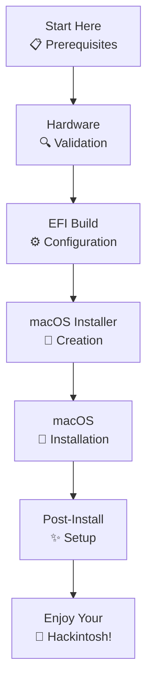

# Dell 3521 Hackintosh - macOS Big Sur 11.0


✅ **Status**: Fully Tested & Working
🍎 **macOS Version**: Big Sur 11.0 (20.99.99)
🖥️ **SMBIOS**: MacBookAir5,2 (i5-3317U)
🔧 **OpenCore Version**: 0.7.8

## 📌 Overview

This repository provides a **complete, step-by-step guide** to install **macOS Big Sur 11.0** on the **Dell Inspiron 3521** laptop with Intel Core i5-3337U (Ivy Bridge) processor using the **OpenCore** bootloader.

> ⚠️ **For Beginners**: This guide assumes you have basic command-line experience. If you're completely new to Hackintoshing, consider starting with the [OpenCore Install Guide](https://dortania.github.io/OpenCore-Install-Guide/).

### 📸 What to Expect


*macOS Big Sur running smoothly on the Dell 3521*

## 🚀 Quick Start

### For Linux Users
1. `git clone` this repository
2. Run `scripts/setup_environment.sh`
3. Run `scripts/create_hardware_report.sh`
4. Run `scripts/build_opencore.sh`
5. Run `scripts/create_usb_installer.sh`
6. Follow [docs/linux-installation.md](docs/linux-installation.md)

### For Windows Users
1. `git clone` or download this repository
2. Run `scripts/windows/setup_environment.bat` (as Admin)
3. Run `scripts/windows/create_hardware_report.ps1`
4. Run `scripts/windows/build_opencore.bat`
5. Run `scripts/windows/create_usb_installer.bat`
6. Follow [docs/windows-installation.md](docs/windows-installation.md)

## 📚 Table of Contents

### Documentation

- [📋 Prerequisites](docs/prerequisites.md)
- [🔍 Hardware Validation](docs/hardware-validation.md)
- [⚙️ EFI Configuration](docs/efi-configuration.md)
- [💾 macOS Installation (Linux)](docs/linux-installation.md)
- [💾 macOS Installation (Windows)](docs/windows-installation.md)
- [🔄 Dual-Boot Guide](docs/dual-boot.md)
- [✨ Post-Install Setup](docs/post-install.md)
- [📈 Performance](docs/performance.md)
- [🐞 Troubleshooting](docs/troubleshooting.md)
- [❓ FAQ](docs/faq.md)

### Scripts

**Linux/macOS:**
- [setup_environment.sh](scripts/setup_environment.sh)
- [create_hardware_report.sh](scripts/create_hardware_report.sh)
- [build_opencore.sh](scripts/build_opencore.sh)
- [create_usb_installer.sh](scripts/create_usb_installer.sh)
- [check_for_private_data.sh](scripts/check_for_private_data.sh)

**Windows:**
- [setup_environment.bat](scripts/windows/setup_environment.bat)
- [setup_environment.ps1](scripts/windows/setup_environment.ps1)
- [create_hardware_report.bat](scripts/windows/create_hardware_report.bat)
- [create_hardware_report.ps1](scripts/windows/create_hardware_report.ps1)
- [build_opencore.bat](scripts/windows/build_opencore.bat)
- [create_usb_installer.bat](scripts/windows/create_usb_installer.bat)
- [check_for_private_data.bat](scripts/windows/check_for_private_data.bat)
- [validate_efi.ps1](scripts/windows/validate_efi.ps1)

### Resources

- [📁 EFI Folder Template](EFI/OC/)
- [🔧 Scripts](scripts/)
- [🖼️ Images](images/)
- [📄 Configuration Examples](config_examples/)

## 💡 How to Use This Guide

This repository is organized to help you follow the Hackintosh process from start to finish. Each document in the `docs/` folder corresponds to a specific step in the process.



## 🎯 What Works

| Component            | Status | Notes                                  |
|---------------------|--------|----------------------------------------|
| **CPU**            | ✅     | Full Ivy Bridge support                |
| **iGPU**           | ✅     | Intel HD 4000 with full acceleration   |
| **Wi-Fi**          | ✅     | Atheros AR9485 with IO80211ElCap.kext  |
| **Bluetooth**      | ✅     | Atheros AR9462 with Ath3kBT*.kext     |
| **Ethernet**       | ✅     | Realtek RTL8136 with RTL8111.kext      |
| **Audio**          | ✅     | Intel HD Audio with AppleALC           |
| **SD Card Reader** | ✅     | Realtek with RealtekCardReader         |
| **USB Ports**      | ✅     | All ports functional after mapping     |
| **Battery**        | ✅     | Status, percentage, management          |
| **Sleep/Wake**     | ✅     | Fully working                          |
| **App Store**      | ✅     | iCloud, iMessage, FaceTime working     |
| **Display**        | ✅     | Brightness control, native resolution   |

## 🛠️ Prerequisites

### Hardware
- Dell Inspiron 3521 (or hardware with similar components)
- **Minimum 4GB RAM** (8GB+ recommended)
- **120GB+ SSD** (required for good performance)
- **≥16GB USB flash drive** (for installer)

### Software
- Linux environment (Ubuntu, CachyOS, etc.)
- Internet connection

### Tools (will be downloaded automatically by scripts)
- OpCore-Simplify
- OpenCorePkg
- ProperTree
- USBToolBox

## 🛒 Recommended Upgrades

| Upgrade               | Benefit                                        | Recommended Model                 |
|-----------------------|------------------------------------------------|-----------------------------------|
| **SSD (250GB+)**      | Massive performance boost                      | Crucial MX500, Samsung 870 EVO   |
| **RAM (8GB)**        | Better multitasking                          | DDR3 1600MHz SODIMM              |
| **Wireless Card**     | Better compatibility & Continuity features    | BCM94352HMB (DW1550)             |

## 📂 Repository Structure

```
Dell-3521-Hackintosh/
├── docs/                      # Detailed documentation
│   ├── prerequisites.md         # Setup requirements
│   ├── hardware-validation.md    # Hardware check
│   ├── efi-configuration.md      # EFI building
│   ├── linux-installation.md     # Linux installation guide
│   ├── windows-installation.md   # Windows installation guide
│   ├── dual-boot.md              # Dual-boot setup
│   ├── macos-installation.md     # General installation
│   ├── post-install.md           # Post-install steps
│   ├── performance.md            # Benchmarks
│   ├── troubleshooting.md        # Common issues
│   └── faq.md                   # Frequently asked questions
│
├── scripts/                   # Linux/macOS scripts
│   ├── setup_environment.sh
│   ├── create_hardware_report.sh
│   ├── build_opencore.sh
│   ├── create_usb_installer.sh
│   ├── check_for_private_data.sh
│   └── windows/               # Windows scripts
│       ├── setup_environment.bat
│       ├── setup_environment.ps1
│       ├── create_hardware_report.bat
│       ├── create_hardware_report.ps1
│       ├── build_opencore.bat
│       ├── create_usb_installer.bat
│       ├── check_for_private_data.bat
│       └── validate_efi.ps1
│
├── EFI/                      # EFI folder structure
│   └── OC/                   # OpenCore configuration
│       ├── ACPI/             # ACPI modifications
│       ├── Drivers/          # OpenCore drivers
│       ├── Kexts/            # Kernel extensions
│       ├── Resources/        # Themes and resources
│       ├── Tools/            # Utility tools
│       └── config.plist      # Configuration file
│
├── images/                   # Visual aids and screenshots
├── config_examples/          # Configuration samples
│
├── README.md                # This file
└── LICENSE                  # License information
```

## 📢 Community & Support

- [r/hackintosh](https://www.reddit.com/r/hackintosh/) - Reddit community
- [Dortania Discord](https://discord.gg/Wxam8aH) - OpenCore support
- [GitHub Issues](https://github.com/username/Dell-3521-Hackintosh/issues) - Report issues or ask questions

## 🧪 Contributing

Contributions are welcome!

1. Fork the repository
2. Create a feature branch (`git checkout -b feature/your-feature`)
3. Commit your changes (`git commit -m 'Add some feature'`)
4. Push to the branch (`git push origin feature/your-feature`)
5. Open a Pull Request

## 📜 License

This project is licensed under the **MIT License** - see the [LICENSE](LICENSE) file for details.


> 🔧 **Pro Tip**: Join the Hackintosh community for the latest updates, tips, and troubleshooting help!

---
💾 *Happy Hackintoshing! ❤️️*