# ⚙️ EFI Configuration with OpCore-Simplify

This guide walks you through building your OpenCore EFI using OpCore-Simplify with the correct kext selections for the Dell 3521.

---

## 📦 Step 1: Launch OpCore-Simplify

```bash
cd ~/Downloads/OpCore-Simplify
./OpCore-Simplify.py
```

---

## 📋 Main Menu Navigation


---

## 📋 Step-by-Step Configuration

### 1. Select Hardware Report
- Choose option **1**
- Navigate to: `/home/shinda/Downloads/Hackintosh/OpCore-Simplify/SysReport/Report.json`
- Press Enter

### 2. Select macOS Version
- Choose option **2**
- Select **20. macOS Big Sur 11**
- (This is the recommended version for Ivy Bridge HD 4000)

### 3. Customize ACPI Patches
- Press **Enter** to skip (default settings are fine)

### 4. Customize Kexts - CRITICAL STEP

Select these kexts by entering their numbers (comma-separated):

```
1,2,3,4,6,8,11,12,17,21,22,23,41,42,44,45,64,65,75,76,80,81,82,84,85
```

#### Kext Selection Table

| Category | # | Kext | Purpose | Required |
|----------|---|------|---------|----------|
| **Required** | 1 | Lilu.kext | Core plugin framework | ✅ |
|  | 2 | VirtualSMC.kext | SMC emulator | ✅ |
| **VirtualSMC Plugins** | 3 | SMCBatteryManager.kext | Battery monitoring | ✅ |
| | 3 | SMCDellSensors.kext | Dell fan/sensors | ✅ |
| | 6 | SMCProcessor.kext | CPU temperature | ✅ |
| | 8 | SMCSuperIO.kext | System sensors | ✅ |
| **Graphics** | 11 | WhateverGreen.kext | GPU patching | ✅ |
| **Audio** | 12 | AppleALC.kext | Audio support | ✅ |
| **Wi-Fi** | 17 | IO80211ElCap.kext | Atheros AR9485 | ✅ |
| **Bluetooth** | 21 | Ath3kBT.kext | BT firmware | ✅ |
| | 22 | Ath3kBTInjector.kext | BT firmware alt | ✅ |
| **Card Reader** | 64 | RealtekCardReader.kext | SD card reader | ✅ |
| | 65 | RealtekCardReaderFriend.kext | System Info detect | ✅ |
| **USB** | 44 | USBToolBox.kext | USB port mapping | ✅ |
| | 45 | UTBDefault.kext | Temp port limit removal | ✅ |
| **Ethernet** | 41 | RealtekRTL8100.kext | Ethernet (RTL8136) | ⚠️ Optional |
| | 42 | RealtekRTL8111.kext | More precise for 8136 | ✅ Recommended |
| **Extras** | 75 | AppleMCEReporterDisabler.kext | Prevent kernel panics | ✅ |
| | 76 | BrightnessKeys.kext | Brightness control | ✅ |
| | 80 | ECEnabler.kext | Dell EC access | ✅ |
| | 81 | FeatureUnlock.kext | Unlock features | Optional |
| | 82 | HibernationFixup.kext | Fix hibernation | ✅ |
| | 84 | RestrictEvents.kext | Block unwanted processes | ✅ (default) |
| | 85 | RTCMemoryFixup.kext | Fix CMOS/RTC | ✅ |

> ⚠️ **Note**: Options 23 (BlueToolFixup) is disabled/grayed out for Big Sur 11.0 - this is expected.

### 3. Customize SMBIOS Model
- Select **Option 30: MacBookAir5,2** (i5-3317U Ivy Bridge)
- This matches your i5-3337U ULV (17W TDP) perfectly

### 3.6 Build OpenCore EFI
- Select **Option 6: Build OpenCore EFI**
- Wait for completion
- EFI will be created in `Results/EFI/`

---

## 🔧 Post-Build Verification

```bash
# Verify EFI structure
ls -la Results/EFI/
ls -la Results/EFI/OC/Kexts/
ls -la Results/EFI/OC/Drivers/
```

Expected output:
```bash
Results/EFI/
├── BOOT/
└── OC/
    ├── ACPI/
    ├── Drivers/
    ├── Kexts/
    ├── Resources/
    ├── Tools/
    ├── ACPI/
    ├── Drivers/
    ├── Kexts/
    ├── Resources/
    ├── Tools/
    ├── config.plist
    └── ...
```

---

## 🔧 Optional: Custom config.plist Tweaks

If you need to manually edit config.plist:

```bash
# Copy to working directory
mkdir -p ~/config_backup
cp Results/EFI/OC/config.plist ~/config_backup/
```

### Common Config Adjustments

| Setting | Location | Value | Purpose |
|---------|----------|-------|---------|
| **Audio Layout** | NVRAM → Add → 7C436110... → boot-args | `alcid=1` (try 1,2,3,7) | Audio layout |
| **Wi-Fi** | NVRAM → Add → 7C436110... → boot-args | `airportatheros=1` | Wi-Fi fix |
| **Bluetooth** | NVRAM → Add → 7C436110... → boot-args | `bluetoothio=1` | BT fix |
| **XhciPortLimit** | Kernel → Quirks → XhciPortLimit | True/False | >15 ports |

> ⚠️ **Important**: Make these changes AFTER building, using ProperTree on macOS.

---

## 📂 Expected EFI Structure

```mermaid
graph TD
    EFI[EFI]
    EFI --> BOOT
    EFI --> OC
    OC --> ACPI
    OC --> Drivers
    OC --> Kexts
    OC --> Resources
    OC --> Tools
    OC --> config.plist
    ACPI --> SSDT-EC.aml
    Drivers --> OpenRuntime.efi
    Drivers --> OpenRuntime.efi
    Kexts --> Lilu.kext
    Kexts --> VirtualSMC.kext
    Kexts --> WhateverGreen.kext
    Kexts --> AppleALC.kext
    Kexts --> IO80211ElCap.kext
    Kexts --> Ath3kBT.kext
    Kexts --> Ath3kBTInjector.kext
    Kexts --> RealtekCardReader.kext
    Kexts --> RealtekCardReaderFriend.kext
    Kexts --> RealtekRTL8111.kext
    Kexts --> USBToolBox.kext
    Kexts --> UTBDefault.kext
    Kexts --> AppleALC.kext
    Kexts --> AppleMCEReporterDisabler.kext
    Kexts --> BrightnessKeys.kext
    Kexts --> ECEnabler.kext
    Kexts --> FeatureUnlock.kext
    Kexts --> HibernationFixup.kext
    Kexts --> RestrictEvents.kext
    Kexts --> RTCMemoryFixup.kext
    Kexts --> WhateverGreen.kext
    Kexts --> SMCDellSensors.kext
    Kexts --> SMCBatteryManager.kext
    Kexts --> SMCProcessor.kext
    Kexts --> SMCSuperIO.kext
    Drivers --> OpenRuntime.efi
    Drivers --> OpenRuntime.efi
```



---

## ✅ Verification Checklist

- [ ] Hardware report validated (0 errors, 0 warnings)
- [ ] SMBIOS: MacBookAir5,2 selected
- [ ] All required kexts selected
- [ ] EFI built successfully in `Results/EFI/`
- [ ] Recovery image downloaded (`com.apple.recovery.boot/`)
- [ ] USB drive ready (≥16GB)

---

## 🚀 Next Steps

📖 **[macOS Installation](macos-installation.md)** → 
Create USB installer, configure BIOS, install macOS Big Sur

