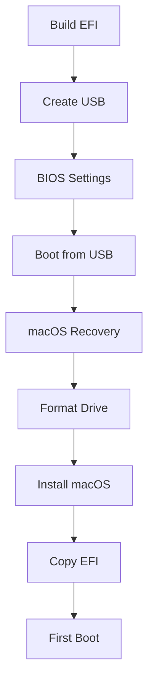

# macOS Installation

Quick start steps for installing macOS Big Sur on Dell 3521.

---

## Installation Flow



---

## Quick Start

### 1. Build EFI

**Linux:**
```bash
cd ~/Downloads/Dell-3521-Hackintosh
./scripts/setup_environment.sh
./scripts/create_hardware_report.sh
./scripts/build_opencore.sh
```

**Windows:**
```cmd
cd %USERPROFILE%\Downloads\Dell-3521-Hackintosh\scripts\windows
setup_environment.bat
create_hardware_report.bat
build_opencore.bat
```

### 2. Create USB

| Method | Platform |
|--------|----------|
| Script | Run `create_usb_installer.sh` or `create_usb_installer.bat` |
| Rufus | Windows: [rufus.ie](https://rufus.ie/) - GPT/UEFI mode |
| GNOME Disks | Linux: Format GPT, FAT32, copy EFI files |

After creating USB, copy to USB root:
- `Output/EFI/`
- `com.apple.recovery.boot/` (from OpCore-Simplify)

### 3. BIOS

Press **DEL** on boot:

- **Secure Boot**: Disabled
- **SATA Mode**: AHCI (not RAID)
- **Boot**: UEFI

### 4. Install

1. Press **F12** → Select USB
2. OpenCore picker → **macOS Recovery**
3. **Disk Utility** → View → Show All Devices
4. Select drive → **Erase**
   - Name: `Macintosh`
   - Format: **APFS**
   - Scheme: **GUID**
5. **Reinstall macOS Big Sur**
6. Wait 40-60 minutes
7. ⚠️ **DO NOT REBOOT after install**

### 5. Copy EFI (Critical!)

In Recovery Terminal before rebooting:

```bash
diskutil mount disk0s1
cp -R /Volumes/OPENCORE/EFI /Volumes/EFI/
diskutil unmount disk0s1
```

### 6. First Boot

1. Remove USB
2. Press **F12** → Boot internal drive
3. Complete macOS setup

---

## Detailed USB Creation

### Script Method (Linux)

```bash
chmod +x scripts/create_usb_installer.sh
./scripts/create_usb_installer.sh
```

Follow prompts - script will:
- List available disks
- Ask for USB device name (e.g., `sdc`)
- Require `YES` to confirm
- Format as GPT/FAT32
- Copy EFI and recovery files

### Rufus Method (Windows)

1. Download [Rufus](https://rufus.ie/)
2. Select USB drive
3. Click `SELECT` → choose macOS .iso/.img
4. Partition scheme: **GPT**
5. Target system: **UEFI (non-CSM)**
6. Click **START**
7. After done, copy `Output/EFI/` to USB's EFI folder
8. Copy `com.apple.recovery.boot/` to USB root

### Manual Method

**Windows:**
```
diskmgmt.msc → Delete USB partitions → Create GPT → Format FAT32
Copy EFI and recovery files manually
```

**Linux:**
```bash
sudo sgdisk -Z /dev/sdX        # Zap
sudo sgdisk -o /dev/sdX         # New GPT
sudo sgdisk -n 1:0:0 -t 1:EF00 /dev/sdX  # EFI partition
sudo mkfs.fat -F32 -n OPENCORE /dev/sdX1
sudo mount /dev/sdX1 /mnt/usb
sudo cp -r Output/EFI/* /mnt/usb/EFI/
```

---

## Expected USB Structure

```
USB Drive/
├── EFI/
│   ├── BOOT/
│   │   └── BOOTX64.efi
│   └── OC/
│       ├── OpenCore.efi
│       ├── config.plist
│       └── ...
└── com.apple.recovery.boot/
    ├── BaseSystem.chunklist
    └── BaseSystem.dmg
```

---

## What If I Forget to Copy EFI?

Boot from USB again → Open Terminal → Copy EFI → Reboot. No data lost.

---

## Next Steps

- **[Post-Install](post-install.md)** - Audio, USB mapping
- **[Troubleshooting](troubleshooting.md)** - Common fixes