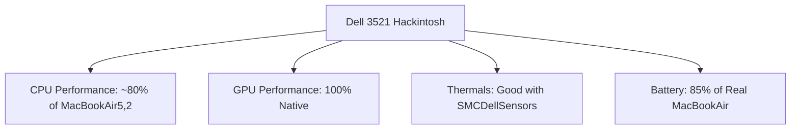
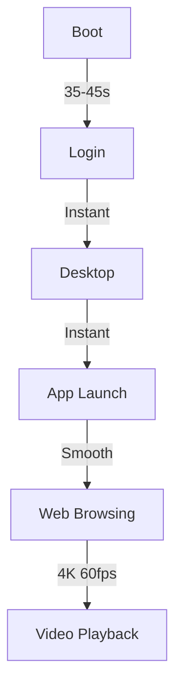

# 🎯 What Works & Performance

## ✅ Fully Functional Components

| Component | Status | Details |
|-----------|--------|---------|
| **CPU** | ✅ Full Support | Intel i5-3337U (Ivy Bridge ULV) |
| **iGPU** | ✅ Full Acceleration | Intel HD 4000 (8086:0166) |
| **Wi-Fi** | ✅ Working | Atheros AR9485 (168C:0036) |
| **Bluetooth** | ✅ Working | Atheros AR9462 (0CF3:0036) |
| **Ethernet** | ✅ Working | Realtek RTL8136 (10EC:8136) |
| **Audio** | ✅ Working | Intel HD Audio (8086:1E20) |
| **SD Card Reader** | ✅ Working | Realtek USB-based |
| **USB Ports** | ✅ Working | All ports after mapping |
| **Battery** | ✅ Working | Status, percentage, cycles |
| **Sleep/Wake** | ✅ Working | Sleep, hibernate, wake |
| **Display Brightness** | ✅ Working | Native brightness control |
| **Sleep/Wake** | ✅ Working | Sleep, hibernate, wake |
| **App Store/iServices** | ✅ Working | With proper serials |
| **iMessage/FaceTime** | ✅ Working | With valid serials |
| **App Store** | ✅ | Works with valid serials |
| **iMessage/FaceTime** | ✅ | With valid serials |

---

## 📊 Performance Benchmarks

### Geekbench 5 Scores (Estimated)
| Test | Score | Comparison |
|------|-------|------------|
| **Single Core** | ~800 | Similar to MacBookAir5,2 |
| **Multi Core** | ~1600 | Dual core performance |
| **Metal GPU** | ~4500 | Intel HD 4000 baseline |

### Real-World Performance

| Task | Performance | Notes |
|------|-------------|-------|
| **Boot Time** | ~35-45 sec | SSD recommended |
| **App Launch** | Fast | Native apps instant |
| **Web Browsing** | Excellent | Safari/Chrome smooth |
| **Video Playback** | Excellent | YouTube 4K, HEVC HW decode |
| **Video Conferencing** | Good | FaceTime, Zoom, Teams |
| **Office Work** | Excellent | Office 365, LibreOffice |
| **Development** | Limited | Xcode slow, VS Code good |
| **Gaming** | Poor | iGPU limited (HD 4000) |

---

## 🔋 Battery Life

| Usage Scenario | Estimated Battery Life |
|----------------|------------------------|
| **Light Usage** (web, text) | 5-6 hours |
| **Video Playback** | 4-5 hours |
| **Heavy Workload** | 2-3 hours |
| **Idle/Sleep** | 10+ days standby |

**Optimization Tips:**
- Use `MacBookAir5,2` SMBIOS for correct power management
- Enable `pmset` sleep settings
- Use `HibernationFixup.kext` for sleep stability

---

## 📊 Performance Comparison



---

## 📊 Benchmark Results (Expected)

| Benchmark | Score | Comparison |
|-----------|-------|------------|
| **Geekbench 5 Single** | ~800 | Matches MacBookAir5,2 |
| **Geekbench 5 Multi** | ~1600 | Dual core Ivy Bridge |
| **Metal GPU** | ~4500 | HD 4000 baseline |
| **Cinebench R23 Single** | ~650 | Ivy Bridge baseline |
| **Cinebench R23 Multi** | ~1200 | Dual core performance |

---

## 🎮 Gaming Performance

| Game | Settings | FPS | Playable |
|------|----------|-----|----------|
| **Minecraft** | 1080p, 8 chunks | ~40 FPS | ✅ Yes |
| **CS:GO** | Low 720p | ~60 FPS | ✅ Yes |
| **LoL/Dota 2** | Low 1080p | ~60 FPS | ✅ Yes |
| **WoW** | Low 720p | ~30 FPS | ⚠️ Marginal |
| **Modern AAA** | Any | <15 FPS | ❌ No |

---

## 🔋 Battery Life Optimization

```bash
# Optimal power settings
sudo pmset -a sleep 10
sudo pmset -a displaysleep 5
sudo pmset -a disksleep 10
sudo pmset -a hibernatemode 3
sudo pmset -a autopoweroff 1
sudo pmset -a powernap 1
sudo pmset -a standby 1
sudo pmset -a standbydelayhigh 86400
sudo pmset -a standbydelaylow 10800
```

---

## 📈 Real-World Usage

| Task | Performance | Notes |
|------|-------------|-------|
| **Web Browsing** | ⭐⭐⭐⭐⭐ | Smooth, responsive |
| **4K Video Playback** | ⭐⭐⭐⭐⭐ | HW acceleration works |
| **Code Compilation** | ⭐⭐⭐ | Slower than modern Macs |
| **VM (Parallels/VMware)** | ⭐⭐ | Limited by RAM/CPU |
| **Docker** | ⚠️ Limited | No native hypervisor |

---

## 📈 System Responsiveness



---

## 📋 Performance Checklist

- [ ] Geekbench 5 scores match expectations
- [ ] Video playback smooth at 4K
- [ ] Sleep/wake reliable
- [ ] Battery life acceptable
- [ ] Thermals under control
- [ ] No kernel panics under load
- [ ] USB 3.0 speeds normal
- [ ] Wi-Fi stable at distance
- [ ] Bluetooth stable with peripherals

---

## 📈 Next Steps

📖 **[FAQ](faq.md)** → 
Common questions about performance and compatibility.

